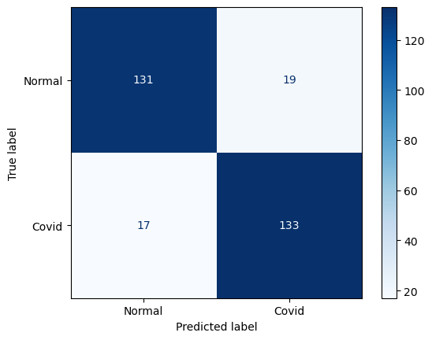

# Automated-COVID-19-diagnosis
- EMCNet: Automated COVID-19 diagnosis from X-ray images using convolutional neural network and ensemble of machine learning classifiers

## Paper CNN Implementation

- Simulating Paper's architecture. Using all public available data for training CNN model.

   

- Applying Meand and Std of the data in training process with same architecture

   

  
---
- Result Table

<!--     -->

- Confusion Matrices for 4 classifiers

  
  
  
  

- Confusion Matric for Ensemble classifier

   

- Receiver Operating Characteristic

   

---
## GUI 
GUI designed for users to make their experience more comfortable
- Start up view of the GUI

   

- An example of detection
- 

   

---

## Contributers
<table>
  <tr>
    <td align="center">
      <a href="https://github.com/Sajad-Ghadiri">
         
        
          <b>Sajad Ghadiri</b>
        
      </a>
    </td>
<!--     <td align="center">
      <a href="https://github.com/MBW0lf">
         
        
          <b>Mohammad Barabadi</b>
        
      </a>
    </td> -->
</table>
